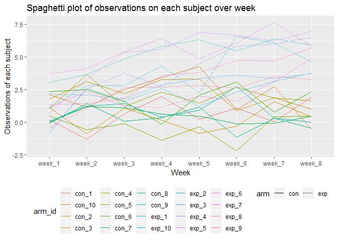
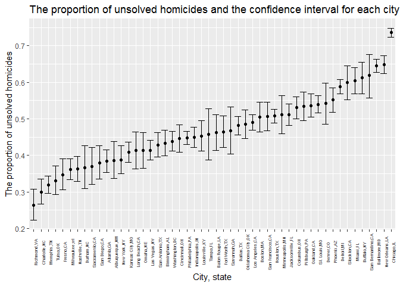

p8105\_hw5\_hx2264
================
Hongyao Xie
November 3, 2018

Problem 1
---------

``` r
library(tidyverse)
```

    ## -- Attaching packages --------------------------------------- tidyverse 1.2.1 --

    ## v ggplot2 3.0.0     v purrr   0.2.5
    ## v tibble  1.4.2     v dplyr   0.7.7
    ## v tidyr   0.8.1     v stringr 1.3.1
    ## v readr   1.1.1     v forcats 0.3.0

    ## -- Conflicts ------------------------------------------ tidyverse_conflicts() --
    ## x dplyr::filter() masks stats::filter()
    ## x dplyr::lag()    masks stats::lag()

``` r
# Start with a dataframe containing all file names
files <- list.files(path = "./data/", pattern = "*.csv")

# Iterate over file names and read in data for each subject using purrr::map and saving the result as a new variable in the dataframe
read_file <- function(x) {
  read.csv(paste0("./data/", x))
}

data_frame <- files %>% 
  map(read_file) %>%
  reduce(rbind) %>% 
  janitor::clean_names()

# Tidy the result
data_frame$arm <- c(rep("con",10), rep("exp",10))
data_frame$id <- c(rep(1:10,2))
data_frame$arm_id = paste(data_frame$arm, 
                          data_frame$id, 
                          sep = "_")

# Make a spaghetti plot showing observations on each subject over time
data_frame <- data_frame %>%
  gather(key = week, value = data, week_1:week_8)

data_frame %>% 
  group_by(arm_id) %>% 
  ggplot(aes(x = week, y = data)) + 
    geom_line(aes(colour = arm_id, group = arm_id, linetype = arm)) +
    theme(legend.position = "bottom") +
    labs(
      title = "Spaghetti plot of observations on each subject over week",
      x = "Week",
      y = "Observations of each subject"
    )
```



In general, the experiment arms had higher observations than the control arms. Besides, the observations in experiment arms increased over time while the observations in control arms remained stable or even decreased over time.

Problem 2
---------

``` r
# Create a city_state variable
homic <-  read_csv("homicide_data.csv") %>% 
  janitor::clean_names() %>% 
  mutate(city_state = paste(city, state, sep = ",")) 
```

    ## Parsed with column specification:
    ## cols(
    ##   uid = col_character(),
    ##   reported_date = col_integer(),
    ##   victim_last = col_character(),
    ##   victim_first = col_character(),
    ##   victim_race = col_character(),
    ##   victim_age = col_character(),
    ##   victim_sex = col_character(),
    ##   city = col_character(),
    ##   state = col_character(),
    ##   lat = col_double(),
    ##   lon = col_double(),
    ##   disposition = col_character()
    ## )

The homicides dataset contains information of more than 52,000 homicides in major American cities during the past ten years. Key variables include victim information(name, age, sex, etc.), disposition, location (city and state). There are 52179 rows and 13 columns.

``` r
# Summarize within cities to obtain the total number of homicides and the number of unsolved homicides
homic_summary <- homic %>% 
  group_by(city_state) %>% 
  mutate(total = n()) %>%
  filter(disposition == "Closed without arrest" |
           disposition == "Open/No arrest") %>% 
  mutate(unsolve = n()) %>% 
  group_by(city_state, total, unsolve) %>% 
  summarize()
homic_summary
```

    ## # A tibble: 50 x 3
    ## # Groups:   city_state, total [?]
    ##    city_state     total unsolve
    ##    <chr>          <int>   <int>
    ##  1 Albuquerque,NM   378     146
    ##  2 Atlanta,GA       973     373
    ##  3 Baltimore,MD    2827    1825
    ##  4 Baton Rouge,LA   424     196
    ##  5 Birmingham,AL    800     347
    ##  6 Boston,MA        614     310
    ##  7 Buffalo,NY       521     319
    ##  8 Charlotte,NC     687     206
    ##  9 Chicago,IL      5535    4073
    ## 10 Cincinnati,OH    694     309
    ## # ... with 40 more rows

``` r
# For the city of Baltimore, MD, use the prop.test function to estimate the proportion of homicides that are unsolved
btm <- homic_summary %>% 
  filter(city_state == "Baltimore,MD")

btm_prop <- prop.test(btm$unsolve, btm$total) %>% 
  broom::tidy() %>% 
  select(estimate, conf.low, conf.high)
```

``` r
# Run prop.test for each of the cities in your dataset, and extract both the proportion of unsolved homicides and the confidence interval for each
prop_ci <- function(x) {
  broom::tidy(x) %>% 
  select(estimate, conf.low, conf.high)
}
all_map <- map2(.x = homic_summary$unsolve, .y = homic_summary$total, ~prop.test(.x, .y))

prop_test_tbl <- map_df(.x = all_map, ~prop_ci(.x)) %>% 
  mutate(city_state = homic_summary$city_state) %>% 
  select(city_state, estimate, conf.low, conf.high)

prop_test_tbl
```

    ## # A tibble: 50 x 4
    ##    city_state     estimate conf.low conf.high
    ##    <chr>             <dbl>    <dbl>     <dbl>
    ##  1 Albuquerque,NM    0.386    0.337     0.438
    ##  2 Atlanta,GA        0.383    0.353     0.415
    ##  3 Baltimore,MD      0.646    0.628     0.663
    ##  4 Baton Rouge,LA    0.462    0.414     0.511
    ##  5 Birmingham,AL     0.434    0.399     0.469
    ##  6 Boston,MA         0.505    0.465     0.545
    ##  7 Buffalo,NY        0.612    0.569     0.654
    ##  8 Charlotte,NC      0.300    0.266     0.336
    ##  9 Chicago,IL        0.736    0.724     0.747
    ## 10 Cincinnati,OH     0.445    0.408     0.483
    ## # ... with 40 more rows

``` r
# Create a plot that shows the estimates and CIs for each city
prop_test_tbl %>% 
  mutate(city_state = forcats::fct_reorder(city_state, estimate)) %>% 
  ggplot(aes(x = city_state, y = estimate)) + 
    geom_point() +
    geom_errorbar(aes(ymin = conf.low, ymax = conf.high)) +
    theme(axis.text.x = element_text(angle = 90, size = 5)) + 
    labs(
      title = "The proportion of unsolved homicides and the confidence interval for each city",
      x = "City, state",
      y = "The proportion of unsolved homicides"
    )
```


